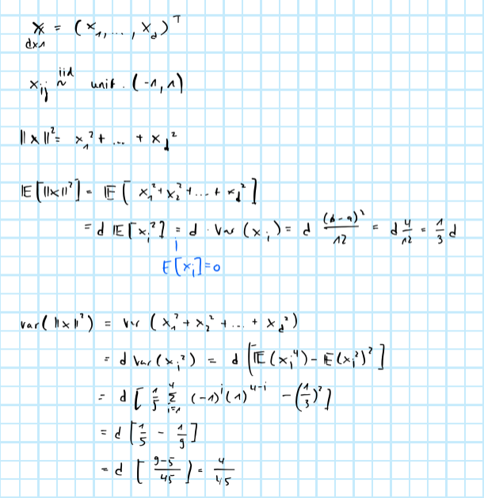

```{r setup, include=FALSE}
rm(list=ls())
knitr::opts_chunk$set(echo = TRUE)
library(reticulate)
```

# Problem 1

## Chebyshev

We can derive Chebyshev's inequality as follows


where the derivation for the expected value of the differences is as follows


and the derivation of the variance term is as follows:


For a fixed distance $\varepsilon$, variance $\sigma^2_m$ and sample size $n$ we can simply solve right-hand side of the concentration inequality for $N$ by equating it to some $\delta$ of our choice. For example, suppose we are interested $\delta=0.10$ and let $n=10000$, $\sigma_m^2=1$, $\varepsilon=0.1$. Then a good choice of $N$ would be 1000:


In other words the choice of $N$ is basically independent of $n$ as $n$ gets large. 

## Hoeffding

It is easy to see that for large choices of $N$ and values of $n$ both estimators have the same expected value. Let $\mu$ denote that expected value. Then noting that each $m(\sigma_j)$ is bounded by $m(\sigma_j) \in [a_i=\min(\mathbf{\mathbf{X}}), b_i=\max(\mathbf{\mathbf{X}})]$ we can apply Hoeffding. For the ideal, infeasible estimator we have

$$
\begin{aligned}
&& p(|\bar{m}_n-\mu| \ge \varepsilon)&= 2\exp\left( \frac{2n^2\varepsilon^2}{ \sum_{i}^{}(b_i-a_i)^2}\right) \\
\end{aligned}
$$
and the expression for $\hat{m}_{n,N}$ is analogous. Noting that this expression depends on $\varepsilon$ we can let this distance to the expected value be different for $\hat{m}_{n,N}$ and $\bar{m}_{n}$. This enables us to make the following claim: with a probability of at least $1-\delta$ we have


which we can rewrite as:


There are two worst-case scenarios that would maximise the distance between the to estimators: either the first inequality is binding on the left side and the second inequality is binding on the right side or the other way around. Under the first case we can write


and since the same logic applies to the second case it follows


which is the distance we were originally after. Now notice that this is very similar to what we obtained earlier when we applied Chebyshev: for given $\delta$, $n$, $\varepsilon$ and $\mathbf{X}$ (given $\mathbf{X}$ both $a$ and $b$ are deterministic) we once again can simply solve for $N$. Using the same parameter choice as before and assuming $a=0$, $b=1$ this solves to $N\approx265$:


Hoeffding's inequality consequently prescribes a lower choice of $N$, which is intuitive since the inequality is tighter. 

## Chernoff

We can apply Chernoff bounds to both estimators. For the ideal, infeasible one we have


and equivalently applying Chernoff to $\hat{m}_{n,N}$ yields the same expression with $N$ instead of $n!$ in the denominator of the exponential. These expressions to not depend on the distance $\varepsilon$ as with Hoeffding, so we cannot apply the same logic as before where we let the distance vary by estimator. However we know that as long as $N<n!$ the concentration inequality for $\bar{m}_n$ will be tighter than for $\hat{m}_{n,N}$. Hence, we can always just look at $\delta_N$ (corresponding to the wider bound) and know that if the inequality holds for $\hat{m}_{n,N}$ then for the same $\delta_N$ it must also hold for $\bar{m}_n$. Hence we could proceed as we did before for Hoeffding, which I omit here.

# Problem 2

The median-of-means estimator and its permutation-invariant Monte-Carlo alternative can be implemented in R as follows:

```{r}
median_of_means <- function(x, block_size=NULL, delta=.05, permutation_invariant=F, N=1000) {
  n <- length(x)
  if (is.null(block_size)) {
    block_size = round(n/(8 * log(1/delta))) # default block size
  }
  if (!permutation_invariant) {
    x <- x[sample.int(n,n)] # shuffle
    blocks <- split(x, ceiling(seq_along(x)/block_size))
    median_of_means <- median(sapply(blocks, mean))
  } else {
    median_of_means <- mean(
      sapply(
        1:N, 
        function(i) {
          x <- x[sample.int(n,n)] # shuffle
          blocks <- split(x, ceiling(seq_along(x)/block_size))
          median_of_means <- median(sapply(blocks, mean))
          return(median_of_means)
        }
      )
    )
  }
  return(median_of_means)
}
```

To run the simulation I first set up a grid of parameter combinations. Samples will be drawn from four distribution: two distributions with light tails -- Gaussian and Laplace -- and two heavy-tailed student-$t$ distributions with one and five degrees of freedom, respectively.

```{r grid-setup, message=FALSE, warning=FALSE}
library(rmutil)
library(data.table)
# Parameters
n <- round(exp(5:10))
block_size_ratio <- c(.01,.1,0.5) # block size ratio of sample size n
N <- c(10, 100) # number of random permutations
# Distribution functions:
t1 <- function(...,df=1) {
  rt(...,df=df)
}
t5 <- function(...,df=5) {
  rt(...,df=df)
}
dist_fun <- list(
  "gauss" = rnorm,
  "laplace" = rlaplace,
  "t1" = t1,
  "t5" = t5
)
grid <- data.table(
  expand.grid(
    n = n,
    dist = names(dist_fun),
    block_size_ratio = block_size_ratio,
    N = N
  )
)
```

I then run across the rows of the grid and for each parameter combination/row run the experiment $J=100$ times each time computing the the three different estimators. Since I generate data with $\mathbb{E}\left(\mathbf{X}\right)=0$, the absolute values of the obtained point estimates correspond to the mean absolute error (MAE). Hence, in order to estimate error probabilities for a given distance $\varepsilon$ it suffices to compute the proportion of draws for which the MAE exceeds $\varepsilon$. Below follows the code that runs experiment: 

```{r run-search, eval=F}
J <- 100 # number of independent samples
P <- nrow(grid) # number of parameter combinations
performance <- rbindlist(
  lapply(
    1:P,
    function(p) {
      list2env(c(grid[p,]), envir = environment()) # load parameters into function scope
      performance <- rbindlist(
        lapply( # loop over J samples 
          1:J,
          function(j) {
            x <- dist_fun[[dist]](n=n) # n random draws from given distribution
            block_size <- block_size_ratio * n
            # Compute the estimates:
            performance <- data.table(
              n = n,
              estimator = c(
                "emp_mean",
                "median_of_means",
                "mom_permutation_inv"
              ),
              estimate = c(
                mean(x),
                median_of_means(x, block_size = block_size),
                median_of_means(x, block_size = block_size, permutation_invariant = TRUE, N=N)
              )
            )
            performance <- merge(grid[p,],performance)
            performance[,sample:=j]
            return(performance)
          }
        )
      )
      return(performance)
    }
  )
)
eps <- data.table(eps=c(0.1,0.025,0.01))
performance <- setkey(performance[,c(k=1,.SD)],k)[eps[,c(k=1,.SD)],allow.cartesian=TRUE][,k:=NULL]
performance[,mae:=abs(estimate)]
performance[,higher_than_eps:=mae>eps]
error_rates <- performance[
  ,
  .(error_rate=sum(higher_than_eps)/.N, mae=mean(abs(estimate))), # error percentage and mean absolute error
  by=.(n,eps,dist,block_size_ratio,N,estimator)
]
saveRDS(performance, file = "data/mean_estimators_performance.rds")
saveRDS(error_rates, file = "data/mean_estimators_error_rates.rds")
```

## Error probabilities

The first plot provides an overall picture of the effects of sample size and distribution as well as insight into how the performacme differs across the different estimators (Figure \@ref(fig:plot-error-rates); block size and $N$ are both held constant). A few unsurprising observations stand out immediately: (i) error rates decrease with sample size, (ii) the probability of decreases with the distance $\varepsilon$ and (iii) error probabilities are generally higher for heavy-tailed distributions due to the presence of outliers. Another observation that holds here and across the following illustrations is that the median-of-means (non permutation-invariant) generally does worse than the other two estimators, except for the very heavy-tailed $t$-distribution with 1 degree of freedom ($t1$). And intuitive result is also that both median-of-means estimators outperform the empirical mean for the $t1$-distribution: they are more robust to outliers than the empirical mean.

```{r plot-error-rates, fig.cap="Probability of error by distribution (columns) and distance from expected value (rows)."}
performance <- readRDS(file = "data/mean_estimators_performance.rds")
error_rates <- readRDS(file = "data/mean_estimators_error_rates.rds")
library(ggplot2)
p <- ggplot(data = error_rates[block_size_ratio==median(block_size_ratio) & N==max(N)], aes(x=log(n), y=error_rate, colour=estimator)) +
  geom_point() +
  geom_line() +
  facet_grid(
    rows = vars(eps),
    cols = vars(dist)
  ) +
  scale_color_discrete(name="Estimator:") +
  labs(
    x="Sample size (logs)",
    y="Probability of error"
  )
p
```

## Mean absolute error

Figure \@ref(fig:mae) instead plots the mean absolute error rates directly. The same picture emerges overall. As the bottom-left panel illustrates, it can be very dangerous to use the empirical mean in the presence of outliers. Bother median-of-mean estimators fair much better.

```{r mae, fig.cap="Mean absolute errors."}
library(ggplot2)
p <- ggplot(data = error_rates[block_size_ratio==median(block_size_ratio) & N==max(N)], aes(x=log(n), y=mae, colour=estimator)) +
  geom_point() +
  geom_line() +
  facet_wrap(~dist, ncol=2, scales = "free") +
  scale_color_discrete(name="Estimator:") +
  labs(
    x="Sample size (logs)",
    y="Mean absolute error"
  )
p
```

## Block size and $N$

The next two illustrations focus on the median-of-means. Figure \@ref(fig:median-of-means) shows the mean absolute error rates for the permutation-invariant median-of-means. I let $N$ vary across rows. Different colours correspond to different block sizes. Errors in the bottom row are generally lower, indicative of the fact that higher values of $N$ mitigates the bias associated with the median-of-means estimator. Smaller block sizes tend to have a similar effect, although this does not always hold.

```{r median-of-means, fig.height=3.5, fig.width=8, fig.cap="Permutation-invariant median-of-means for different choices of $N$ and different block sizes."}
p <- ggplot(data = error_rates[estimator=="mom_permutation_inv"], aes(x=log(n), y=mae, colour=factor(block_size_ratio))) +
  geom_point() +
  geom_line() +
  facet_wrap(
    N~dist,
    scales = "free_y",
    ncol = 4
  ) +
  scale_color_discrete(name="Block size ratio:") +
  labs(
    x="Sample size (logs)",
    y="Mean absolute error"
  )
p
```

Interestingly, block size appears to have the opposite effect on the median-of-means estimator that does not take into account the effect of permutations. Excpet for the very heavy-tailed $t1$-distribution, smaller block sizes tend to produce better results. This is simply due to the fact that as the block size approaches 1, the median-of-means estimator approaches the empirical mean. As we have seen in the previous charts, the empirical mean is unbiased and hence a better choice whenever outliers are not a big deal.

```{r mom, fig.cap="Median-of-means without bias correction."}
p <- ggplot(data = error_rates[estimator=="median_of_means" & N==max(N)], aes(x=log(n), y=mae, colour=factor(block_size_ratio))) +
  geom_point() +
  geom_line() +
  facet_wrap(
    ~dist,
    scales = "free_y",
    ncol = 2
  ) +
  scale_color_discrete(name="Block size ratio:") +
  labs(
    x="Sample size (logs)",
    y="Mean absolute error"
  )
p
```

# Problem 3

The first two moments can be derived as follows:



In order to derive a concentration inequality when can apply Chernoff:


On order to determine the "typical" magnitude of the cosine of the angle between the two independent vectors, it may suffice to specify the first two moments of the distribution of the cosine. 

## Unconditonal moments of cosine

In order to derive the expected value of the cosine, assume the norm of both $\mathbf{X}$ and $\mathbf{Y}$ is equal to 1. Then we have the following:


Of course, this only holds under the assumption we made. But notice that we can always find some vector $\mathbf{a}$ such that $||\mathbf{a}||=c||\mathbf{X}||$ and $\mathbf{b}$ such that $||\mathbf{b}||=k||\mathbf{Y}||$ while the angle between $\mathbf{a}$ and $\mathbf{b}$ may still be the same as before. In other words we can stretch or squeeze both $\mathbf{X}$ and $\mathbf{Y}$ such that their norm changes, but the angle between remains the same. For such $\mathbf{a}$ and $\mathbf{b}$ we still have that the expected value of the cosine is zero.

For the variance we can proceeds as follows:


*Here I got stuck and did not know how to proceed*.

# Problem 4

The program can be implemented in R as follows:

```{r}
random_projection <- function(n,d=2) {
  I <- diag(n) # matrix of basis vectors
  w <- matrix(rnorm(2*n), nrow=n) # random 2-d vector of weights
  A <- I %*% w # linear projection
  A_stand <- (A - mean(A[,1]))/sd(A[,1]) # center and rescale 
  dt <- data.table(A_stand, type="proj")
  v <- matrix(rnorm(2*n), nrow=n) # some random Gaussian 2-d vector
  dt <- rbind(dt, data.table(v, type="normal"))
  dt[,n:=n]
  return(dt)
}
```

Applying this for different values of $n$ yields the picture below. It turns out that the random projection of $n$-dimesional basis vectors onto the $2$-dimensional plane is also random and hence resembles random draws from a bivariate Gaussian distribution.

```{r}
n <- round(exp(4:9))
dt <- rbindlist(
  lapply(
    n,
    function(i) {
      random_projection(i)
    }
  )
)
p <- ggplot(data = dt, aes(x=V1, y=V2, colour=type)) +
  geom_point() +
  facet_wrap(~factor(n), ncol=3) +
  scale_color_discrete(name="Type:")
p
```


