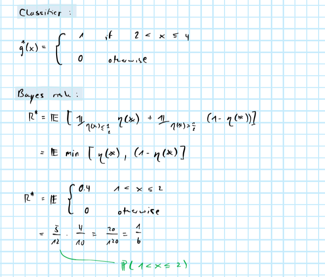
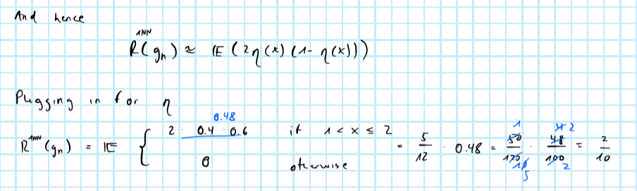

```{r setup, include=FALSE}
rm(list=ls())
knitr::opts_chunk$set(echo = TRUE)
library(reticulate)
library(data.table)
```

# Piece-wise CDFs

We are given the conditional CDFs 


from which the conditional PDFs can be derived:


Then we have for the joint PDF:


Using Bayes rule we can then determine a functional form for $\eta(\mathbf{X})$


which can be illustrated as follows:


## Bayes classifier and risk

Then we have for the Bayes classifier and corresponding risk:



## 1-NN

For the 1-NN we can not that the following holds asymptotically:


And consequently applying this here we get:



## 3-NN

Similarly, we can show for the 3-NN rule:


# Nearest neighbor regression

We can derive the optimal predictor as follows:


In other words, the optimal predictor $f^*$ of $\mathbf{Y}$ given $\mathbf{X}$ is just the conditional mean of $\mathbf{Y}$ given $\mathbf{X}$.

```{r}
source("R/knn_regressor.R")
```

```{r, eval=FALSE}
d <- 1
n <- c(100,1000,10000)
beta <- abs(c(1,rep(rnorm(d,mean = 0.2))))
sigma <- 0.1
k <- 1
output <- rbindlist(
  lapply(
    1:length(n),
    function(i) {
      X <- matrix(rnorm(d*n[i]),n[i])
      y <- cbind(1,X) %*% beta + rnorm(n[i],sd = sigma)
      y_hat_ols <- qr.fitted(qr.default(cbind(1,X)),y)
      y_hat_knn <- knn_regressor(X,y,k)
      output <- data.table(
        type=c("ols","knn"),
        mse=c(mean((y-y_hat_ols)^2), mean((y-y_hat_knn)^2)),
        n=n[i]
      )
      return(output)
    }
  )
)
```


# Bayes risk

# NN for binary classification

```{r}
source("R/knn_classifier.R")
```


```{r}
sim_data <- function(n,d) {
  X <- matrix(runif(n*d),n) # uniform 0,1
  p_y <- rowSums(X[,1:2])/2 # probabilities of each Bernoulli trial
  y <- rbinom(n, 1, p_y)
  return(list(X=X,y=y))
}
```


```{r, eval=F}
set.seed(111)
d <- round(exp(1:4))
n <- round(exp(4:8))
k <- c(1,3,5,7,9)
J <- 100 # number of independent samples
grid <- data.table(expand.grid(n=n,d=d,k=k))
output <- rbindlist(
  lapply(
    1:nrow(grid),
    function(i) {
      list2env(c(grid[i,]), envir = environment())
      performance <- rbindlist(
        lapply( # loop over J samples 
          1:J,
          function(j) {
            list2env(sim_data(n,d),envir = environment())
            fitted <- knn_classifier(X,y,k)
            prob_error <- sum(y!=fitted)/n
            performance <- data.table(
              k = k,
              n = n,
              j = j,
              d = d,
              prob_error = prob_error
            )
            return(performance)
          }
        )
      )
      return(performance)
    }
  )
)
saveRDS(output, file="data/knn_errors.rds")
```

```{r}
library(ggplot2)
output <- readRDS(file="data/knn_errors.rds")
ggplot(data=output[,.(prob_error=mean(prob_error)),by=.(k,n,d)], aes(x = log(n), y=prob_error)) +
  geom_line() +
  geom_point() +
  facet_grid(
    rows = vars(d),
    cols = vars(k)
  )
```

