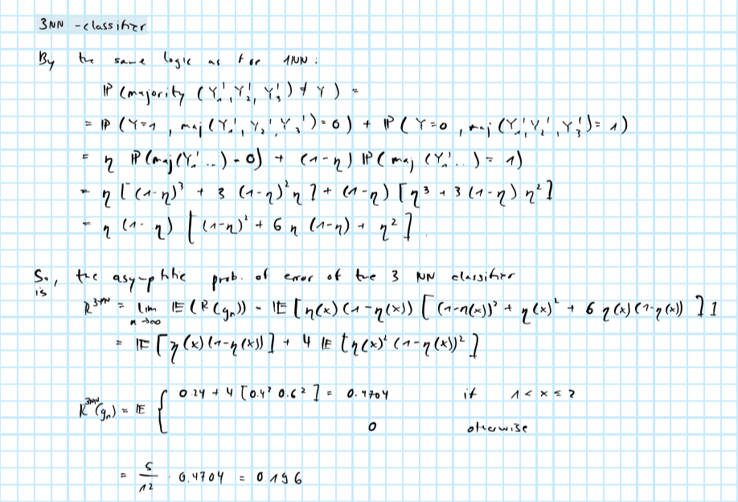
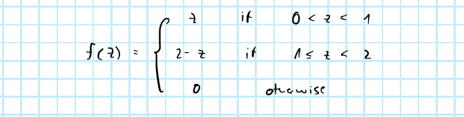

```{r setup, include=FALSE}
rm(list=ls())
knitr::opts_chunk$set(echo = FALSE)
library(reticulate)
library(data.table)
```

# Piece-wise CDFs

We are given the conditional CDFs 


from which the conditional PDFs can be derived:


Then we have for the joint PDF:


Using Bayes rule we can then determine a functional form for $\eta(\mathbf{X})$


which can be illustrated as follows:


## Bayes classifier and risk

Then we have for the Bayes classifier and corresponding risk:


## 1-NN

For the 1-NN we can not that the following holds asymptotically:


And consequently applying this here we get:


## 3-NN

Similarly, we can show for the 3-NN rule:



\pagebreak

# Nearest neighbor regression

## Maths

We can derive the optimal predictor as follows:


In other words, the optimal predictor $f^*$ of $\mathbf{Y}$ given $\mathbf{X}$ is just the conditional mean of $\mathbf{Y}$ given $\mathbf{X}$.

Then the Bayes risk just corresponds to the irreducible error $R^*=\sigma_{\varepsilon}^2$:


Now note that for any KNN regressor we can decompose its risk as follows:


where for the variance term we can further simplify:


Then asymptotically we can show:


Then it is finally easy to see the asymptotic risks of the 1NN and KNN regressor:


## Program

The KNN regressor can be implemented in R as follows:

```{r code=readLines("R/knn_regressor.R"), echo=TRUE, eval=FALSE}
```

Using this regressor I simulate data multiple times, fit and predict from the regressor and compute the mean squared error each time. I vary the dimensions $d$, the number of neighbours $k$ and the sample size $n$.

```{r}
source("R/knn_regressor.R")
```

```{r, eval=FALSE}
set.seed(111)
d <- round(exp(1:4))
n <- round(exp(4:8))
k <- c(1,3,5,7,9)
J <- 100 # number of independent samples
sigma <- 0.1
grid <- data.table(expand.grid(n=n,d=d,k=k))
output <- rbindlist(
  lapply(
    1:nrow(grid),
    function(i) {
      list2env(c(grid[i,]), envir = environment())
      beta <- abs(c(1,rep(rnorm(d,mean = 0.2))))
      performance <- rbindlist(
        lapply( # loop over J samples 
          1:J,
          function(j) {
            X <- matrix(rnorm(d*n),n)
            y <- cbind(1,X) %*% beta + rnorm(n,sd = sigma)
            fitted <- knn_regressor(X,y,k)
            mse <- mean((y-fitted)^2)
            performance <- data.table(
              k = k,
              n = n,
              j = j,
              d = d,
              mse = mse
            )
            return(performance)
          }
        )
      )
      return(performance)
    }
  )
)
saveRDS(output, file="data/knn_reg_errors.rds")
```

Below in Figure \@ref(fig:rmse) I plot the resulting estimated root mean squared error (RMSE) against (log) sample size for different values of dimension $d$. Each column represents a different choice of $K$ increasing from left to right. We can make three important and intuitive observations:

1. The probability of error decreases with sample size. This is expected since asymptotically the distance between the label of $x_i$ and its neighbours labels approaches zero.

2. The probability of error decreases somewhat with $K$ (for large values of $n$). This reflects that the complexity of the KNN regressor is inversely related to $K$ and hence its variance decreases as we increase the number of neighbours. Since asymptotically the bias of the KNN regressor is zero anyway, we can do better by decreasing the variance of the estimator through higher choices of $K$.

3. The probability of error for fixed $n$ explodes as the dimensionality increases. This is driven by the fact that the bias -- i.e. is the distance between $x_i$ and its neighbours -- takes longer to converge to zero as $d$ grows. In particular, that distance is typically of the order of $n^{- \frac{1}{d}}$. 

```{r rmse, fig.height=2, fig.width=10, fig.cap="Root mean squared error (RMSE) of KNN regressor for different sample sizes and dimensions. The number of K nearest neighbours increases from left to right."}
library(ggplot2)
output <- readRDS(file="data/knn_reg_errors.rds")
ggplot(data=output[,.(mse=mean(mse)),by=.(k,n,d)], aes(x = log(n), y=sqrt(mse), colour=factor(d))) +
  geom_line() +
  geom_point() +
  facet_grid(
    cols = vars(k)
  ) +
  scale_color_discrete(name="Dimension:") +
  labs(
    x="Sample size (logs)",
    y="RMSE"
  )
```

\pagebreak

# Bayes risk $R_k^* \le e^{-ck}$

**Disclaimer:** I have spent quite some time on this one and thought of various approaches, but for none of them really managed to convince myself.

## Using majority rule

An approaching using the majority rule is as follows:


And hence:


## Cases

Another approach I thought about was to look at the two cases of the minimum. By the conditional independence assumption we have:


The we can look at the two cases as follows:


\pagebreak

# NN for binary classification

## Maths

Bayes risk and the asymptotic risks of the different KNN classifiers involves an expectation with respect to $\eta(\mathbf{X})= \frac{x^{(1)}+x^{(2)}}{2}$. To solve for that we first need to know the density of $z=x^{(1)}+x^{(2)}$. It turns out that $z$ follows a *triangular* distribution with density




This can be shown as follows:


Then consider the following two cases: (1) $0<z\le1$ and (2) $1<z<2$. For these cases we have the following:


Using this density function we can now solve for the expectation.

### Bayes risk

The Bayes risk is $R^*= \frac{1}{3}$ which can be computed as follows:


### 1NN

The risk of the 1NN classifier is $R^{1NN}= \frac{5}{12}$ which can be shown as follows:


A quick sanity check shows that 

$$
\begin{aligned}
&& R^{1NN}&=\frac{5}{12}< \frac{4}{9} = 2 R^*(1-R^*)
 \\
\end{aligned}
$$

### 3NN

The risk of the 3NN classifier is $R^{3NN}= \frac{47}{120}$ which can be shown as follows:


In conclusion we have that:

$$
\begin{aligned}
&& R^*&= \frac{40}{120} < R^{3NN}= \frac{47}{120} < R^{1NN}= \frac{50}{120}\\
\end{aligned}
$$

At the limit where $n \rightarrow \infty$ these asymptotic quantities do not depend on the dimensionality. This is because the bias of the KNN classifier -- that is the distance between $x_i$ and its neighbours -- eventually converges to zero as $n$ grows very large. As we saw earlier for the KNN regressor, this is the only point where the dimensionality comes into play, and evidently at the limit it has no effect on the probability of error. However, the dimensionality does affect the *rate* of convergence as we discussed in class. In other words, the higher $d$, the longer it takes to reach the asymptotic quantities, which will become more evident in the following section.

## Program

The KNN classifier can be implemented in R as follows:

```{r code=readLines("R/knn_classifier.R"), echo=TRUE, eval=FALSE}
```

```{r}
source("R/knn_classifier.R")
```

To simulate the data I use the following helper function:

```{r, echo=TRUE}
sim_data <- function(n,d) {
  X <- matrix(runif(n*d),n) # uniform 0,1
  p_y <- rowSums(X[,1:2])/2 # probabilities of each Bernoulli trial
  y <- rbinom(n, 1, p_y)
  return(list(X=X,y=y))
}
```


I then run the programm multiple times varying the dimension $d$, the number of neighbours $k$ and the sample size $n$. Each time I compute the frequency of error and finally average over those frequencies to obtain an estimate of the probability of error.

```{r, eval=F}
set.seed(111)
d <- round(exp(1:4))
n <- round(exp(4:8))
k <- c(1,3,5,7,9)
J <- 100 # number of independent samples
grid <- data.table(expand.grid(n=n,d=d,k=k))
output <- rbindlist(
  lapply(
    1:nrow(grid),
    function(i) {
      list2env(c(grid[i,]), envir = environment())
      performance <- rbindlist(
        lapply( # loop over J samples 
          1:J,
          function(j) {
            list2env(sim_data(n,d),envir = environment())
            fitted <- knn_classifier(X,y,k)
            prob_error <- sum(y!=fitted)/n
            performance <- data.table(
              k = k,
              n = n,
              j = j,
              d = d,
              prob_error = prob_error
            )
            return(performance)
          }
        )
      )
      return(performance)
    }
  )
)
saveRDS(output, file="data/knn_errors.rds")
```

Below in Figure \@ref(fig:prob-error) I plot the resulting estimated probability of error against (log) sample size for different values of dimension $d$. Each column represents a different choice of $K$ increasing from left to right. We can make three important and intuitive observations, very similar to what we have seen earlier for the KNN regressor.

1. The probability of error decreases with sample size. This is expected since asymptotically the distance between the label of $x_i$ and its neighbours labels approaches zero.

2. The probability of error decreases with $K$ (for large values of $n$). This reflects that the complexity of the KNN classifier is inversely related to $K$ and hence its variance decreases as we increase the number of neighbours. Since asymptotically the bias of the KNN classifier is zero anyway, we can do better by decreasing the variance of the estimator through higher choices of $K$.

3. The probability of error for fixed $n$ increases as the dimensionality increases. This is driven by the fact that the bias -- i.e. is the distance between $x_i$ and its neighbours -- takes longer to converge to zero as $d$ grows. In particular, that distance is typically of the order of $n^{- \frac{1}{d}}$. Contrary to the KNN regressor the distance between labels of $x_i$ and its neighbours is of course bounded in this case, so we do not observe the same explosive increase in the error.

```{r prob-error, fig.width=10, fig.height=2, fig.cap="Probability of error of KNN classifier for different sample sizes and dimensions. The number of K nearest neighbours increases from left to right."}
library(ggplot2)
output <- readRDS(file="data/knn_errors.rds")
ggplot(data=output[,.(prob_error=mean(prob_error)),by=.(k,n,d)], aes(x = log(n), y=prob_error, colour=factor(d))) +
  geom_line() +
  geom_point() +
  facet_grid(
    cols = vars(k)
  ) +
  scale_color_discrete(name="Dimension:") +
  labs(
    x="Sample size (logs)",
    y="Probability of error"
  )
```


