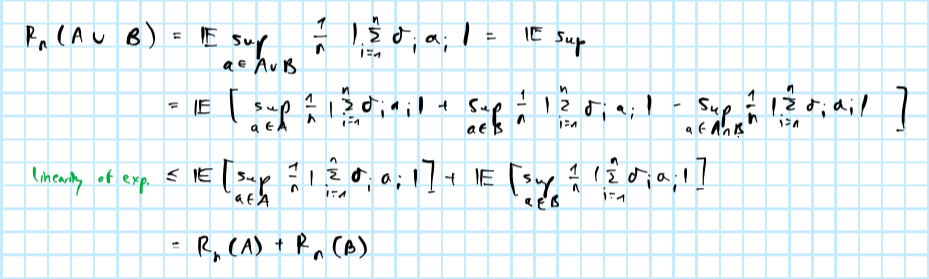

```{r setup, include=FALSE}
rm(list=ls())
knitr::opts_chunk$set(echo = FALSE, tidy=TRUE, tidy.opts=list(width.cutoff=50))
library(data.table)
library(reticulate)
```

# Problem 9

## Graphical proof

We can first consider this problem graphically like we did in class, where we recursively increase $n$ and check if it is still feasible to shatter the $n$ points. A formal proof follows below.

Let us begin by looking at the class of all circles:

```{=tex}
\begin{equation} 
\begin{aligned}
&& \mathcal{A}&=\{C_{c,r}: c \in \mathbb{R}^2, r \ge 0\} \\
\end{aligned}
(\#eq:all)
\end{equation}
```
As you can see below, we can shatter the points through circles of varying radii for $n=3$. For $n=4$ the shatter coefficient is $S_{\mathcal{A}}(4)=14<2^4$. In the picture below no sets can be formed including only points that lie on "opposite" sides of the group of four (pairs $\{A,C\}$ and $\{B,D\}$).


We can scatter the points differently to make one such set feasible (blue circle including $A$ and $C$ below), but then the set $\{A,B,D\}$ is no longer feasible and hence still $S_{\mathcal{A}}(4)=14$.


The class of circles with radius one

```{=tex}
\begin{equation} 
\begin{aligned}
&& \mathcal{A}&=\{C_{c,1}: c \in \mathbb{R}^2\} \\
\end{aligned}
(\#eq:one)
\end{equation}
```
is a subset of the class of all circles, hence we know for sure that it VC dimension can be at most 3. To test if it is actually 3 we can just test if $n=3$ points can still be shattered. The picture below shows that this is indeed possible.


## Formal proof


# Problem 10

## $R_n(A \bigcup B) \le R_n(A) + R_n(B)$



## $R_n(cA)=|c|R_n(A)$


## $R_n(A \bigoplus B) \le R_n(A) + R_n(B)$


## $R_n(\text{absconv}(A))=R_n(A)$


# Problem 11

Let $j=[1,k]$ denote the indices of the non-zero elements of $w$. Then

$$
\begin{aligned}
&& \sum_{i=1}^{d}x_iw_i&= \sum_{j=1}^{k}x_jw_j\\
\end{aligned}
$$

and hence we can rewrite $\mathcal{A}$ as

$$
\begin{aligned}
&& \mathcal{A}&=\{x \in \mathbb{R}^k: \sum_{j=1}^{k}x_jw_j \ge 0\} \\
\end{aligned}
$$

Then from the Theorem we proved in class it follows that $V_{\mathcal{A}} \le k$. This bound is tighter than for the unrestricted case.

# Problem 12

The helper function below is used to generate the data:

```{r, echo=TRUE}
gen_data <- function(n, d) {
  X <- matrix(runif(n=n*d,min=-2^(1/d),max=2^(1/d)), nrow=n)
  y <- as.numeric(sapply(1:n, function(i) {!any(X[i,]<(-1) | X[i,]>1)}))
  return(list(X=X,y=y))
}
```

```{r, echo=FALSE}
N <- 100
n <- 100
```

A quick sense-check confirms that indeed roughly half of the draws from $y$ are equal to 1: the table below shows the average counts of zeros and ones across `r N` samples from $y$ of size $n=`r n`$.

```{r}
library(kableExtra)
kable(colMeans(t(sapply(1:N, function(i) table(gen_data(n,5)$y)))), col.names = "Average count")
```

The classifiers are implemented as classes in Python. The smallest cube classifier can be implemented as follows

```{python, echo=TRUE}
import numpy as np
class SmallestCubeClassifier():
  def __init__(self):
    pass
  def fit(self,X,y):
    if type(y) is not np.ndarray:
      y = np.array(y)
    if type(X) is not np.ndarray:
      X = np.array(X)
    idx = np.array([i for i in range(len(y)) if y[i]==1])
    self.bound = np.max(np.abs(X[idx,]))
  def transform(self,X):
    self.predicted = np.array(
      [int(i.all()) for i in (X >= (-1) * self.bound) & (X <= self.bound)]
    )
    return self.predicted
```

where `np.max(np.abs(X[idx,]))` imposes that $a= \max_{i: y=1}(|x_i|)$. That is, it chooses the maximum absolute value of $\mathbf{X}$ conditional on $y=1$.

Similarly, the smallest rectangle classifier can be implemented as follows:

```{python, echo=TRUE}
class SmallestRectangleClassifier():
  def __init__(self):
    pass
  def fit(self,X,y):
    if type(y) is not np.ndarray:
      y = np.array(y)
    if type(X) is not np.ndarray:
      X = np.array(X)
    idx = np.array([i for i in range(len(y)) if y[i]==1])
    self.bounds = [
      [np.min(X[idx,j]) for j in range(X.shape[1])], 
      [np.max(X[idx,j]) for j in range(X.shape[1])]
    ]
  def transform(self,X):
    self.predicted = np.array(
      [int(i.all()) for i in (X >= self.bounds[0]) &(X <= self.bounds[1])]
    )
    return self.predicted
```

The code below runs the program for different choices of $n$ and $d$. In each iteration $b$ it generates a train and test set of equal size $n^{(b)}$.

```{r, eval=FALSE, echo=TRUE}
set.seed(111)
d <- round(exp(seq(2,6,length.out=10)))
n <- round(exp(seq(3,9,length.out=50)))
J <- 10 # number of independent test sets
classifier_instances <- list(
  "cube" = py$SmallestCubeClassifier(),
  "rectangle" = py$SmallestRectangleClassifier()
)
grid <- data.table(expand.grid(n=n,d=d,classifier_name=names(classifier_instances)))
output <- rbindlist(
  lapply(
    1:nrow(grid),
    function(i) {
      list2env(c(grid[i,]), envir = environment())
      performance <- rbindlist(
        lapply( # loop over J samples 
          1:J,
          function(j) {
            train <- gen_data(n,d) # training data 
            X_train <- train[["X"]]
            y_train <- train[["y"]]
            test <- gen_data(n,d) # test data (same size)
            X_test <- test[["X"]]
            y_test <- test[["y"]]
            # Classify:
            classif <- classifier_instances[[classifier_name]]
            classif$fit(X_train, y_train) # fit
            predicted <- classif$transform(X_test) # test
            error <- sum(predicted!=y_test)/length(y_test)
            performance <- data.table(
              n = n,
              j = j,
              d = d,
              error = error,
              classif = classifier_name
            )
            return(performance)
          }
        )
      )
      # message("Done with:")
      # message(c(grid[i,]))
      return(performance)
    }
  )
)
saveRDS(output, file="data/erm.rds")
```

Figure \@ref(fig:prob-error) plots the resulting error frequencies. Evidently, the cube classifier does a much better job than the rectangle classifier. The latter depends significantly on the dimension, while the former does not (see Figure \@ref(fig:cube) for a clearer picture of the cube classifier). Given that the rectangle classifier essentially classifies for each dimension, it is not surprising at all that its performance depends on $d$: for each $[a_i,b_i]$ there is a chance of choosing bounds that are too tight and hence wrongfully classifying $y_i=1$ as $0$. But then one might wonder if the opposite does not apply to the cube classifier: by choosing a more conservative maximum absolute bound does it not increase the likelihood of misclassifying $y_i=0$ as $1$? By construction this cannot happen, since the $a= \max_{i: y=1}(|x_i|)$ is bounded by $1$. As it approached $1$ for large $n$ the rule underlying the cube classifier essentially just resembles the rule we use to generate the data in the first place, so it is not surprising that the error rate approaches zero very fast.

```{r prob-error, fig.height=4, fig.width=10, fig.cap="Probability of error of the two classifiers for different sample sizes and dimensions."}
library(ggplot2)
output <- readRDS(file="data/erm.rds")
p <- ggplot(data=output[,.(prob_error=mean(error)),by=.(classif,n,d)], aes(x = n, y=prob_error, colour=factor(d))) +
  geom_line() +
  scale_color_discrete(name="Dimension:") +
  scale_linetype_discrete(name="Classifier:") +
  labs(
    x="Sample size",
    y="Probability of error"
  ) + 
  facet_grid(
    cols = vars(classif)
  )
p
```

```{r cube, fig.cap="Focus on cube classifier."}
p <- ggplot(data=output[classif=="cube",.(prob_error=mean(error)),by=.(classif,n,d)], aes(x = n, y=prob_error, colour=factor(d))) +
  geom_line() +
  scale_color_discrete(name="Dimension:") +
  scale_linetype_discrete(name="Classifier:") +
  labs(
    x="Sample size",
    y="Probability of error"
  ) 
p
```
